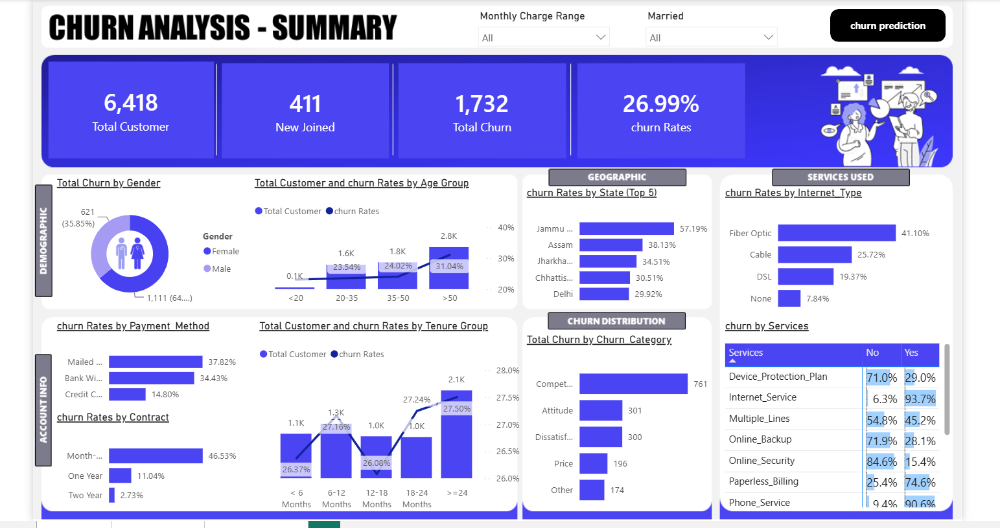
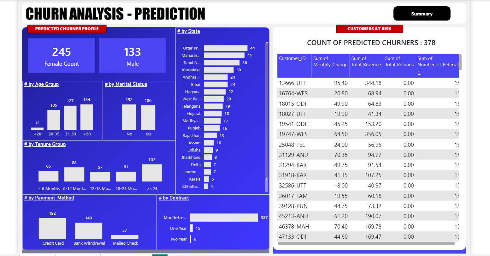

# Customer Churn Prediction Analytics

An end-to-end **Customer Churn Prediction and Analytics** project combining **SQL, Python, Machine Learning, and Power BI** to analyze customer churn and predict customers who are likely to leave.

## 📌 Project Overview

Customer churn is an important business problem because losing existing customers can reduce revenue and increase customer acquisition costs.

This project analyzes customer data and builds a Machine Learning solution to identify potential churners. The results are then presented through an interactive Power BI dashboard.

### Project Objectives

* Analyze customer churn patterns
* Prepare and transform customer data using SQL and Python
* Build a Machine Learning model for churn prediction
* Identify customers predicted to churn
* Analyze predicted churners by customer characteristics
* Create an interactive Power BI dashboard
* Generate business insights for customer retention

---

## 🛠️ Technologies Used

* **Python**
* **Pandas**
* **Scikit-learn**
* **Random Forest Classifier**
* **SQL**
* **Power BI**
* **Jupyter Notebook**

---

## 🔄 Project Workflow

```text
Customer Data
     ↓
SQL Data Preparation
     ↓
Python Data Cleaning
     ↓
Feature Encoding
     ↓
Random Forest Model
     ↓
Customer Churn Prediction
     ↓
Predictions.csv
     ↓
Power BI Dashboard
     ↓
Business Insights
```

---

## 🤖 Machine Learning

A **Random Forest Classifier** is used to predict customer churn.

### Process

1. Load customer data
2. Clean and preprocess the data
3. Encode categorical features
4. Prepare model features
5. Train the Random Forest model
6. Generate customer churn predictions
7. Filter predicted churners
8. Export predictions to `Predictions.csv`
9. Analyze the predictions using Power BI

---

## 📊 Power BI Dashboard

The Power BI report contains two main dashboard pages.

### 1. Churn Analysis – Summary

The summary dashboard analyzes overall customer behavior and churn patterns, including:

* Total customers
* New customers
* Total churn
* Churn rate
* Churn by gender
* Churn by age group
* Churn by state
* Churn by contract
* Churn by payment method
* Churn by tenure
* Churn by internet type
* Churn categories

### 2. Churn Analysis – Prediction

The prediction dashboard focuses on customers predicted to churn.

It analyzes:

* Predicted churner count
* Predicted churners by gender
* Predicted churners by age group
* Predicted churners by marital status
* Predicted churners by tenure
* Predicted churners by state
* Predicted churners by payment method
* Predicted churners by contract
* Customer-level prediction details

---

## 🖼️ Dashboard Screenshots

### Churn Analysis – Summary



### Churn Analysis – Prediction



> If the images do not display, open the `dashboard` folder in this repository to view them directly.

---

## 📈 Key Results

The Machine Learning model generated customer-level churn predictions that were integrated into Power BI for further analysis.

### Key dashboard metrics

* **Total Customers:** 6,418
* **Total Churned Customers:** 1,732
* **Overall Churn Rate:** 26.99%
* **Predicted Churners:** 378

The project moves beyond historical churn reporting by using Machine Learning to identify **customers who may be at risk of churn**.

---

## 💡 Business Value

The project helps answer three key business questions:

### What is happening?

Identify the overall level and patterns of customer churn.

### Why is it happening?

Analyze churn across demographics, contracts, services, payment methods, tenure, and other customer attributes.

### Who is likely to churn?

Use Machine Learning predictions to identify customers who may require proactive retention efforts.

This allows businesses to move from **reactive churn analysis to proactive customer retention**.

---

## 📁 Repository Structure

```text
Customer-Churn-Prediction-Analytics/
│
├── dashboard/
│   ├── dashboard_summary.png
│   └── dashboard_prediction.png
│
├── SQL/
│   └── churn_analysis.sql
│
├── Churn Analysis.pbix
├── Prediction_Data.csv
├── Predictions.csv
├── churn prediction.ipynb
├── README.md
└── .gitignore
```

---

## 📂 Project Files

### `churn prediction.ipynb`

Contains Python data preprocessing, feature encoding, Random Forest model training, and churn prediction.

### `Churn Analysis.pbix`

Interactive Power BI report containing the churn analysis and Machine Learning prediction dashboards.

### `Prediction_Data.csv`

Dataset used for customer prediction and analysis.

### `Predictions.csv`

Machine Learning output containing customer-level churn predictions.

### `SQL/`

Contains SQL queries used for data preparation and analysis.

### `dashboard/`

Contains Power BI dashboard screenshots so the dashboards can be viewed directly from GitHub.

---

## 🚀 Future Improvements

* Deploy the churn prediction model as a web application
* Automate the data pipeline
* Add real-time churn scoring
* Compare Random Forest with XGBoost and other models
* Add automated customer retention recommendations
* Automate Power BI data refresh

---

## 👨‍💻 Author

**Guna Sekhar**

**B.Tech – Computer Science Engineering**

**Project Focus:**
Data Analytics | SQL | Python | Machine Learning | Power BI
